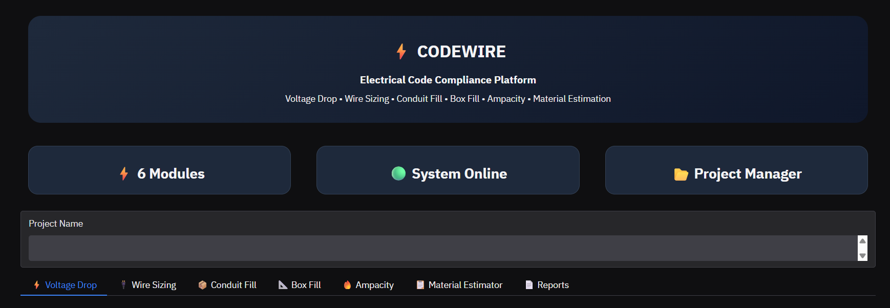
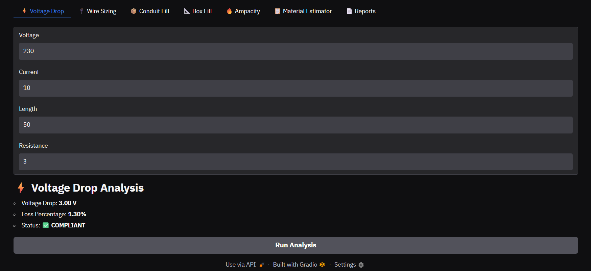
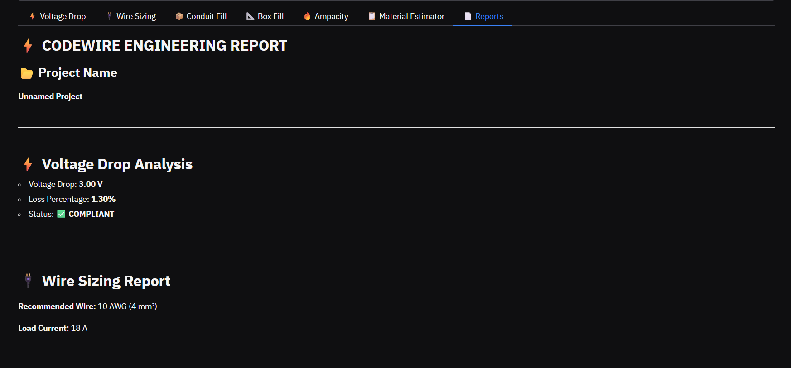

# ⚡ Codewire

### Electrical Code Compliance Platform

Codewire is an Electrical Engineering Analysis Platform designed to assist engineers, students, and technicians in performing common electrical code compliance calculations through a simple and interactive interface.

---

## 🚀 Features

### ⚡ Voltage Drop Analysis
- Calculate voltage drop across conductors
- Determine percentage loss
- Compliance status indication

### 🔌 Wire Sizing
- Recommend wire size based on load current
- Supports common AWG standards

### 📦 Conduit Fill Analysis
- Estimate conduit occupancy
- Recommend suitable conduit size

### 📐 Box Fill Calculation
- Calculate required electrical box volume
- Based on conductors, devices, and grounds

### 🔥 Ampacity Checker
- Verify safe current carrying capacity
- Quick lookup for common wire sizes

### 📋 Material Estimator
- Estimate required wire length
- Estimate conduit requirements

### 📄 Engineering Reports
- Generate complete project reports
- Export reports as PDF

---

## 🖼️ Screenshots

### Dashboard



### Voltage Drop Analysis



### Engineering Report



---

## 🛠️ Technologies Used

- Python
- Gradio
- ReportLab

---

## ▶️ Installation

Clone the repository:

```bash
git clone https://github.com/AreefRasool/Codewire.git
```

Install dependencies:

```bash
pip install -r requirements.txt
```

Run application:

```bash
python app.py
```

---

## 📊 Project Modules

| Module | Purpose |
|----------|----------|
| Voltage Drop | Power loss analysis |
| Wire Sizing | Wire recommendation |
| Conduit Fill | Conduit occupancy calculation |
| Box Fill | Electrical box sizing |
| Ampacity | Current carrying capacity |
| Material Estimator | Material requirement estimation |
| Reports | PDF engineering reports |

---

## 👨‍💻 Author

**Areef Rasool**

Electrical Engineering Analysis Platform developed using Python and Gradio.

---

## 📄 License

This project is developed for educational and academic purposes.
